# AGW UI Interaction Protocol

AGW UI Interaction Protocol 用于定义前端应用如何与智能体平台通信，包括公开 HTTP API、实时 SSE 事件流、共享数据模型，以及典型接入用例。

这里的 Agent Platform 是协议默认主体；Gateway 只是其中一种兼容部署模式，协议本身不要求中间必须存在 Gateway。

动画首页入口见 [index.html](index.html)，首页主图已切到正式版 `02 AGW Basic Sequence`，并支持“重新播放动画”。

## 阅读顺序

1. [协议概览](docs/overview.md)
2. [架构与交互图](docs/architecture.md)
3. [共享数据模型](docs/data-models.md)
4. [HTTP API](docs/http-api.md)
5. [SSE 事件模型](docs/sse-events.md)
6. [交互时序图](docs/interaction-sequences.md)
7. [接入用例](docs/use-cases.md)
8. [资源导航](docs/resources.md)

## 文档导航

| 文档 | 说明 |
| --- | --- |
| [docs/overview.md](docs/overview.md) | 协议定位、分层边界、术语和阅读指引 |
| [docs/architecture.md](docs/architecture.md) | 系统参与方、架构图、交互总览图和主流程说明 |
| [docs/data-models.md](docs/data-models.md) | `Reference`、各类 ID、引用标记和通用约定 |
| [docs/http-api.md](docs/http-api.md) | 全部公开 HTTP 接口 |
| [docs/sse-events.md](docs/sse-events.md) | SSE 传输约定与事件模型 |
| [docs/interaction-sequences.md](docs/interaction-sequences.md) | 7 张编号化主时序图 |
| [docs/use-cases.md](docs/use-cases.md) | 典型请求与事件流闭环示例 |
| [docs/resources.md](docs/resources.md) | SDK、前端测试项目、录屏入口占位页 |

## 核心时序图

### 01 总览图


### 02 基础多轮 Query



### 03 Steer 图



### 04 Interrupt 图



### 05 Question 图



### 06 Approval 图



### 07 Artifact 图



更多说明见 [docs/interaction-sequences.md](docs/interaction-sequences.md)。

## 协议边界

- 所有公开请求都以 `/api` 为前缀。
- `/api/query` 直接返回 `text/event-stream`，不是普通 JSON 响应。
- `request.*`、`run.*`、`task.*`、`content.*` 等名称属于 SSE 事件层，不要求和 HTTP API 形成 1:1 命名映射。
- `POST /api/interrupt` 的结果在流层体现为 `run.cancel`，不会额外产生一个 `request.interrupt` 事件。
- `POST /api/submit` 的 HTTP 字段名是 `awaitingId`；当前流内 `request.submit` 事件仍使用 `toolId`。

## 仓库结构

```text
.
├── index.html
├── README.md
├── docs/
│   ├── overview.md
│   ├── architecture.md
│   ├── data-models.md
│   ├── http-api.md
│   ├── sse-events.md
│   ├── interaction-sequences.md
│   ├── use-cases.md
│   └── resources.md
└── assets/
    └── diagrams/
        ├── 01-agw-seq-overview.svg
        ├── 02-agw-seq-basic.svg
        ├── 03-agw-seq-steer.svg
        ├── 04-agw-seq-interrupt.svg
        ├── 05-agw-seq-question.svg
        ├── 06-agw-seq-approval.svg
        └── 07-agw-seq-artifact.svg
```
