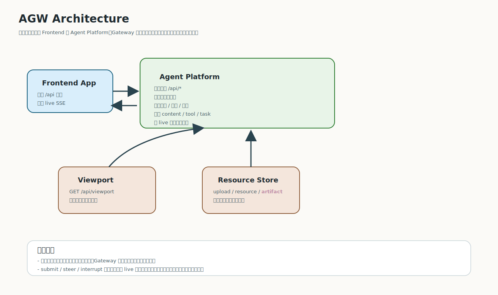
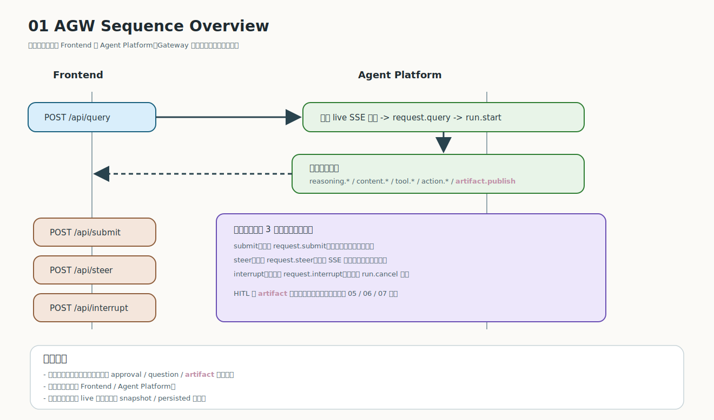

# 架构与交互图

## 1. 系统参与方

协议涉及的主要角色如下：

- Frontend App：发起请求、订阅 SSE、渲染内容、提交交互
- Gateway API：协议统一入口，对外暴露 `/api/*`
- Agent Router：根据 `agentKey`、策略或上下文选择目标智能体
- Agents：执行推理、调用工具、生成内容和动作
- Resource Store：存放上传文件、图片、产物和可下载资源
- Viewport Renderer：承载前端工具/表单/UI 视图

## 2. 架构图

### 结构说明

- 前端只与 Gateway 交互，不直接调用 Agent
- Gateway 负责把请求路由到单个 Agent 或多 Agent 协作链路
- 上传文件、图片、产物和资源下载统一通过 Resource Store 管理
- Viewport 相关内容通过 `viewportKey` 获取
- Query 的执行过程通过 SSE 持续回到前端

## 3. 交互逻辑图

### 逻辑说明

- 主入口是 `POST /api/query`
- 网关立即建立 SSE 通道，把执行过程以事件流回传
- 运行过程中可以继续发送 `submit`、`steer`、`interrupt`
- `submit` 用于前端工具交互结果提交
- `steer` 用于给正在进行的 run 注入额外用户指令
- `interrupt` 用于终止当前 run，流层结果表现为 `run.cancel`

## 4. 三条关键链路

### 查询链路

1. 前端发送 `POST /api/query`
2. Gateway 建立 SSE 响应
3. 输出 `request.query`
4. 根据需要输出 `chat.start`、`plan.update`、`run.start`
5. 运行过程中输出 `reasoning.*`、`content.*`、`tool.*`、`action.*`
6. 结束时输出 `run.complete` 或 `run.cancel` / `run.error`
7. 传输层输出 `data:[DONE]`

### 资源链路

1. 前端发送 `POST /api/upload`
2. Gateway 返回 `upload` 信息
3. 前端把上传结果映射为 `Reference`
4. 后续在 `query` 中通过 `references[]` 或 `#{{refid}}` 使用
5. 资源内容通过 `GET /api/resource` 获取

### 视图交互链路

1. Agent 运行时通过 `tool.start` 暴露 `viewportKey`
2. 前端用 `GET /api/viewport` 获取视图 payload
3. 用户在前端完成表单或操作
4. 前端通过 `POST /api/submit` 回传结果
5. 后续结果继续在同一 SSE 流中体现

## 5. 设计重点

- 对前端暴露统一协议，不泄漏底层 Agent 实现差异
- HTTP 层与 SSE 事件层解耦，便于同步确认和异步渲染并存
- 引用对象统一建模，减少上传、工作区、截图等来源差异
- 视图和资源都通过稳定键或路径检索，方便前端缓存和重试
- 会话级状态如 `plan`、`artifact` 可以被聚合，而不是重复散落在历史事件里
