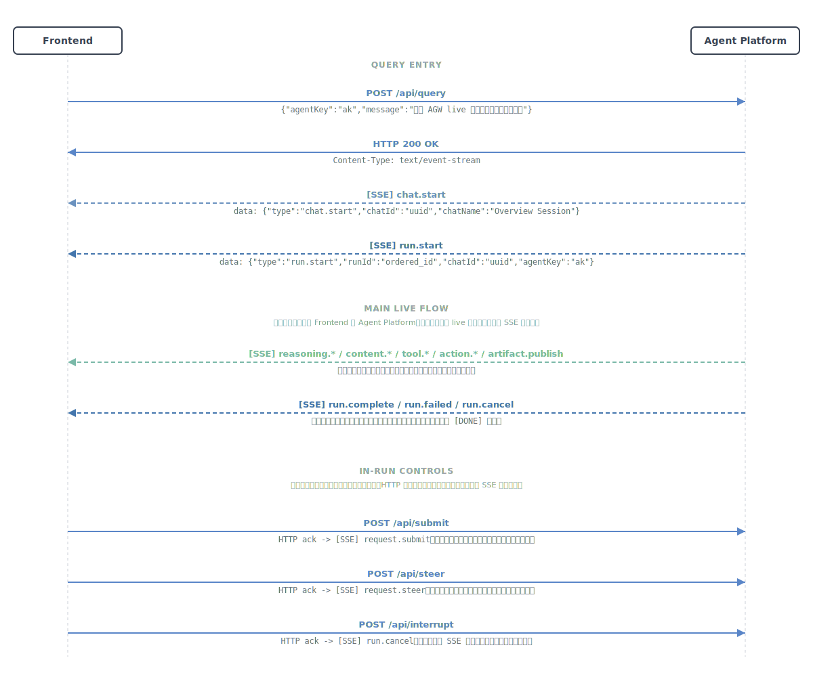

# 架构与交互图

## 1. 系统参与方

协议涉及的主要角色如下：

- Frontend App：发起请求、订阅 SSE、渲染内容、提交交互
- Agent Platform：协议统一入口，对外暴露 `/api/*`
- Run-Agent：执行推理、调用工具、生成内容和动作
- Resource Store：存放上传文件、图片、产物和可下载资源
- Viewport Renderer：承载前端工具/表单/UI 视图

Gateway 可以是 Agent Platform 的一种兼容部署模式，但不是协议必须角色。

## 2. 交互总览图

### 逻辑说明

- 主入口是 `POST /api/query`
- 平台立即建立 SSE 通道，把执行过程以事件流回传
- 运行过程中可以继续发送 `submit`、`steer`、`interrupt`
- `submit` 用于前端工具交互结果提交
- `steer` 用于给正在进行的 run 注入额外用户指令
- `interrupt` 用于终止当前 run，流层结果表现为 `run.cancel`

## 3. 编号化主图

完整细分图请见：[交互时序图](interaction-sequences.md)

- `02-agw-seq-basic-steer-interrupt.svg`：基础 Query 主流 + Steer + Interrupt
- `03-agw-seq-hitl.svg`：approval、question、bash 三类 HITL 合并图
- `04-agw-seq-artifact.svg`：一次工具结果，多条 `artifact.publish`

## 4. 补充架构示意

### 结构说明

- 前端默认只与 Agent Platform 交互，不直接调用某个具体 Agent
- 平台负责请求接入、运行编排、资源访问和 live SSE 回传
- 上传文件、图片、产物和资源下载统一通过 Resource Store 管理
- Viewport 相关内容通过 `GET /api/viewport` 获取

这张架构图只是补充说明部署与组件关系；协议主入口与时序理解以 `01-04` 四张编号主图为准。

## 5. 三条关键链路

### 查询链路

1. 前端发送 `POST /api/query`
2. 平台建立 SSE 响应
3. 输出 `request.query`
4. 根据需要输出 `chat.start`、`plan.update`、`run.start`
5. 运行过程中输出 `reasoning.*`、`content.*`、`tool.*`、`action.*`
6. 结束时输出 `run.complete` 或 `run.cancel` / `run.error`
7. 传输层输出 `[DONE]`

### 资源链路

1. 前端发送 `POST /api/upload`
2. 平台返回 `upload` 信息
3. 前端把上传结果映射为 `Reference`
4. 后续在 `query` 中通过 `references[]` 或 `#{{refid}}` 使用
5. 资源内容通过 `GET /api/resource` 获取

### 视图交互链路

1. 运行时通过 live SSE 发出 `tool.start`、`awaiting.ask`，并按 HITL 类型决定是否追加 `awaiting.payload`
2. 前端根据 `awaiting.ask.viewportKey` 或业务约定选择合适 UI
3. 如需视图 payload，前端通过 `GET /api/viewport` 获取
4. 用户在前端完成表单或操作
5. 前端通过 `POST /api/submit` 回传结果；HTTP 字段名是 `awaitingId`
6. 后续结果继续在同一 SSE 流中体现

补充说明：

- approval：`questions` 在 `awaiting.ask` 顶层，没有 `awaiting.payload`
- question：`awaiting.ask` 先声明等待态，问题列表通过 `awaiting.payload` 下发
- bash：原始 `_sandbox_bash_` 工具外，还会出现 synthetic `_hitl_confirm_dialog_` 工具；`request.submit` 绑定 synthetic tool，且其 `tool.result` 先于 original bash tool 的 `tool.result`
