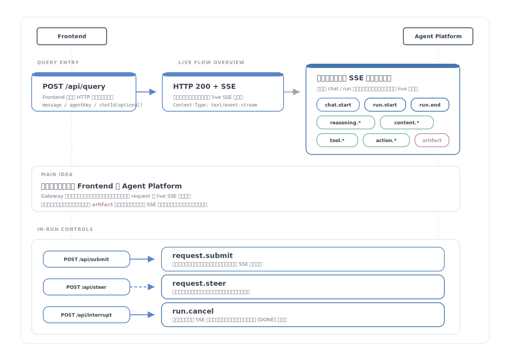

# 交互时序图

本页把 AGW 的 live 协议交互收敛为 7 张编号化主图，只覆盖前端真实可见的 `HTTP + live SSE`，不画 snapshot / persisted 历史事件。

如果启用 WebSocket，业务先后关系不变；变化的是建流方式与传输承载：

- `/api/query` 可以改为 `/ws` 上的 `/api/query request frame`
- live 事件改由 `stream frame` 承载
- `submit / steer / interrupt` 可以通过同一条 WS 连接发出

因此本页不再复制一套“7 张 WebSocket 版时序图”，而是继续用 HTTP + SSE 主路径表达业务语义。

## 01 总览图

总览图只负责说明 Query、Submit、Steer、Interrupt、HITL、Artifact 的入口关系与分流，不展开复杂分支细节。

## 02 基础多轮 Query

这张图只画基础 Query 主流，并把同一个 chat 中的两次 run 并列出来：

- 首次请求：`POST /api/query -> [chat.start] -> run.start -> ... -> run.complete`
- 后续请求：复用 `chatId`，再次 `POST /api/query -> run.start`
- 关键差异：`chat.start` 只在创建新 chat 时出现，后续 turn 不再重复

## 03 Steer

这张图单独展开运行中的 steer 控制分支：

- 图从运行中已有的 `content.start` 开始，不展示 `/api/query` 建流阶段
- `POST /api/steer -> HTTP ack` 之后，原正文先 `content.end`，再插入 `request.steer`
- 随后在同一条原始 SSE 流里开启新的 `content.start`，并正常 `run.complete`

## 04 Interrupt

这张图单独展开运行中的 interrupt 控制分支：

- 图从运行中已有的 `content.start` 开始，不展示 `/api/query` 建流阶段
- `POST /api/interrupt -> HTTP ack -> run.cancel`
- 流里不会出现 `request.interrupt`
- `[DONE]` 属于通用传输层收尾，不在这张细分图里单独展开

## 05 Question

这张图只画 question 分支：

- `awaiting.ask` 先声明等待态
- `questions` 通过 `awaiting.payload` 下发
- `POST /api/submit` 的 HTTP 字段名是 `awaitingId`
- 流内 `request.submit` 当前仍使用 `toolId`，并继续在同一条 SSE 流中体现

## 06 Approval

这张图只画 approval 分支：

- `tool.args -> tool.end -> awaiting.ask`
- `questions` 直接位于 `awaiting.ask` 顶层
- approval 没有 `awaiting.payload`
- `request.submit` 与后续 `tool.result` 仍继续在同一条 SSE 流中体现

## 07 Artifact

这张图只画运行中的 artifact 分支：

- 图从运行中的 `tool.start` 开始，不展示 `/api/query` 建流阶段
- `tool.start -> tool.args -> tool.end -> tool.result`
- 一次工具调用可以在 `tool.result` 之后连续发出多条 `artifact.publish`

## 统一边界

- 默认主体是 `Frontend / Agent Platform`
- Gateway 只是兼容部署模式，不是协议必须角色
- 不画 `reasoning.snapshot`、`content.snapshot`、`tool.snapshot`、`action.snapshot`
- 不画不存在的 `request.interrupt`
- 不在 `tool.start` 上标注当前实现没有的 `toolType`、`viewportKey`、`toolTimeout`
- `POST /api/submit` 的 HTTP 字段名是 `awaitingId`；当前流内 `request.submit` 事件仍使用 `toolId`
