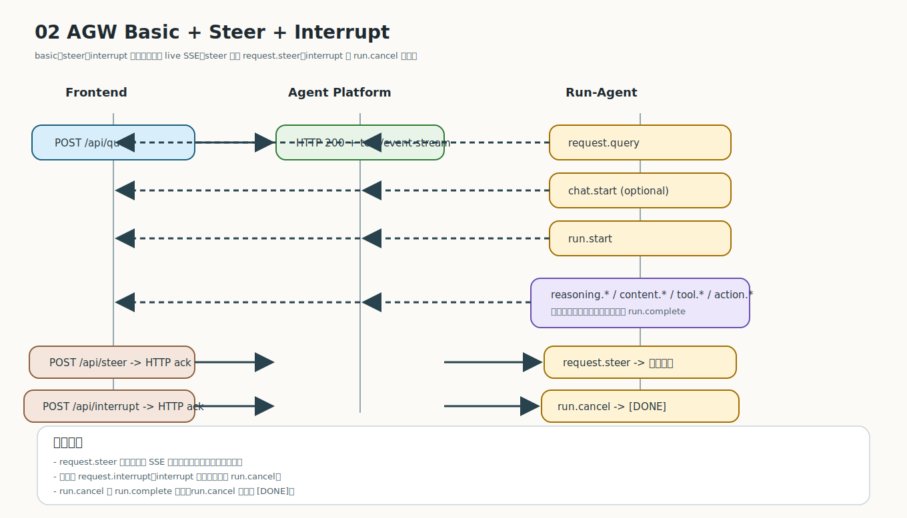
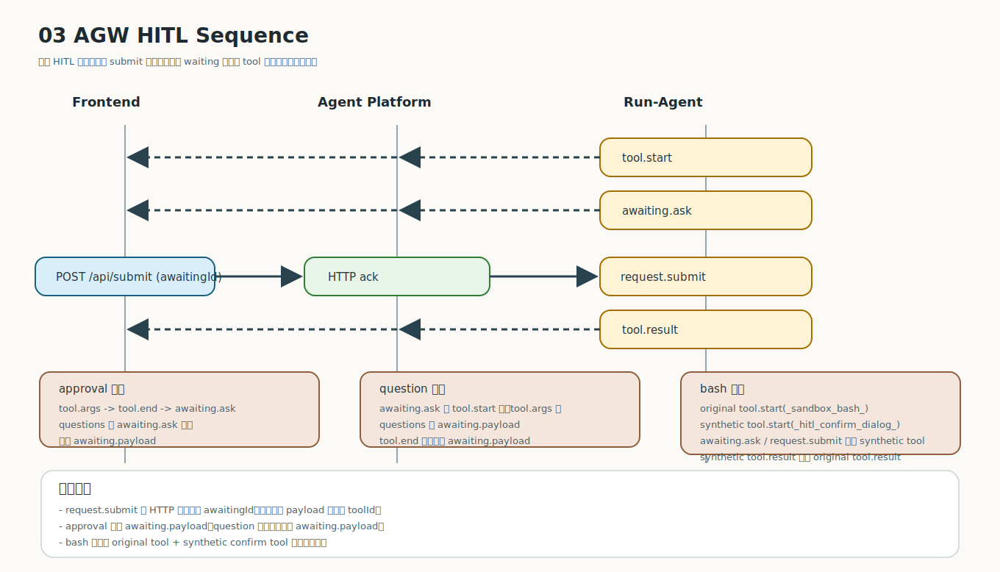
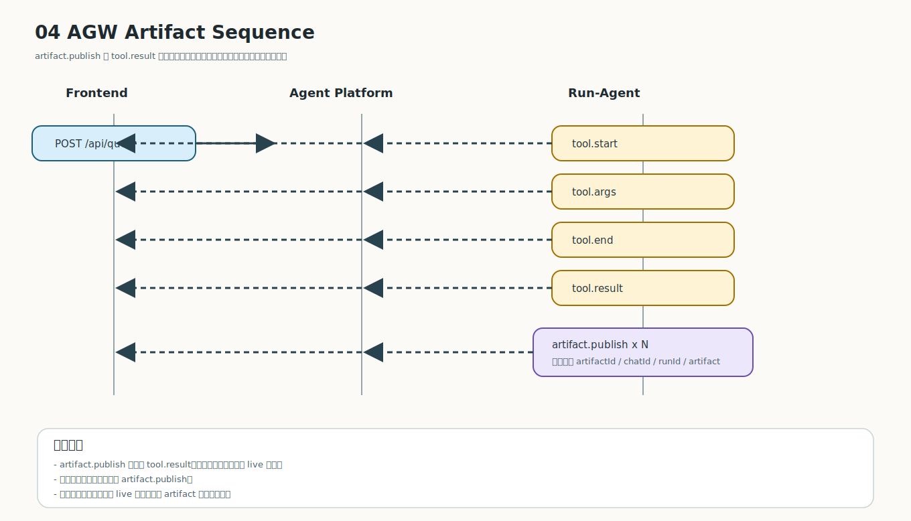

# 交互时序图

本页把 AGW 的 live 协议交互收敛为 4 张编号化主图，只覆盖前端真实可见的 `HTTP + live SSE`，不画 snapshot / persisted 历史事件。

## 01 总览图

总览图只负责说明 Query、Submit、Steer、Interrupt、HITL、Artifact 的入口关系与分流，不展开复杂分支细节。

## 02 基础主流 + Steer + Interrupt

这张图把基础 Query 主流、运行中 Steer、运行中 Interrupt 合并到同一个时序图里：

- 主干：`request.query -> [chat.start] -> run.start -> reasoning.* / content.* / tool.* / action.*`
- steer 分支：`POST /api/steer -> HTTP ack -> request.steer -> 原流继续`
- interrupt 分支：`POST /api/interrupt -> HTTP ack -> run.cancel -> [DONE]`

## 03 HITL 合并图

这张图合并 approval、question、bash 三类 HITL：

- approval：`tool.args -> tool.end -> awaiting.ask`，`questions` 在 `awaiting.ask`，没有 `awaiting.payload`
- question：`awaiting.ask` 在 `tool.start` 后、`tool.args` 前，`questions` 在 `awaiting.payload`
- bash：原始 `_sandbox_bash_` 工具会绑定 synthetic `_hitl_confirm_dialog_`；`awaiting.ask` / `request.submit` 绑定 synthetic tool，且 synthetic `tool.result` 先于 original bash tool 的 `tool.result`

## 04 Artifact 图

一次工具调用可以在 `tool.result` 之后连续发出多条 `artifact.publish`。

## 统一边界

- 默认主体是 `Frontend / Agent Platform / Run-Agent`
- Gateway 只是兼容部署模式，不是协议必须角色
- 不画 `reasoning.snapshot`、`content.snapshot`、`tool.snapshot`、`action.snapshot`
- 不画不存在的 `request.interrupt`
- 不在 `tool.start` 上标注当前实现没有的 `toolType`、`viewportKey`、`toolTimeout`
- `POST /api/submit` 的 HTTP 字段名是 `awaitingId`；当前流内 `request.submit` 事件仍使用 `toolId`
