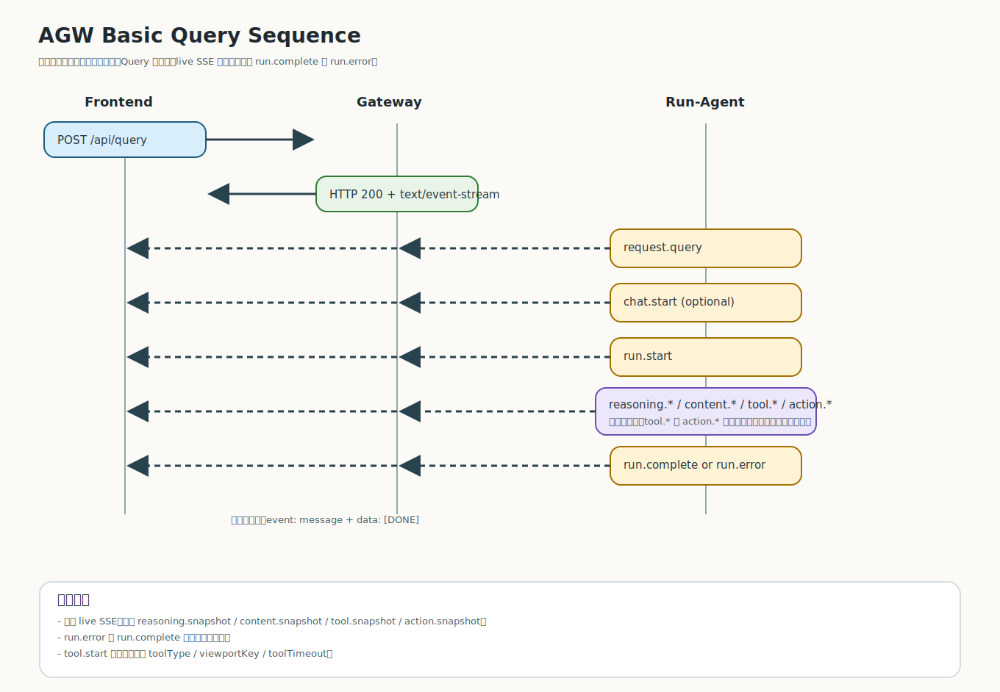
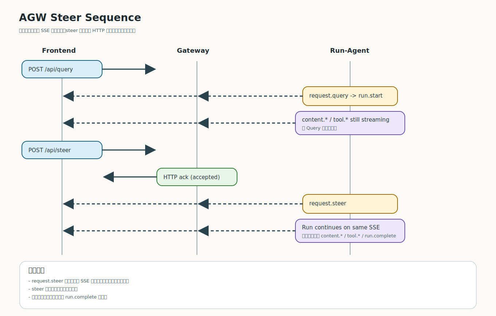
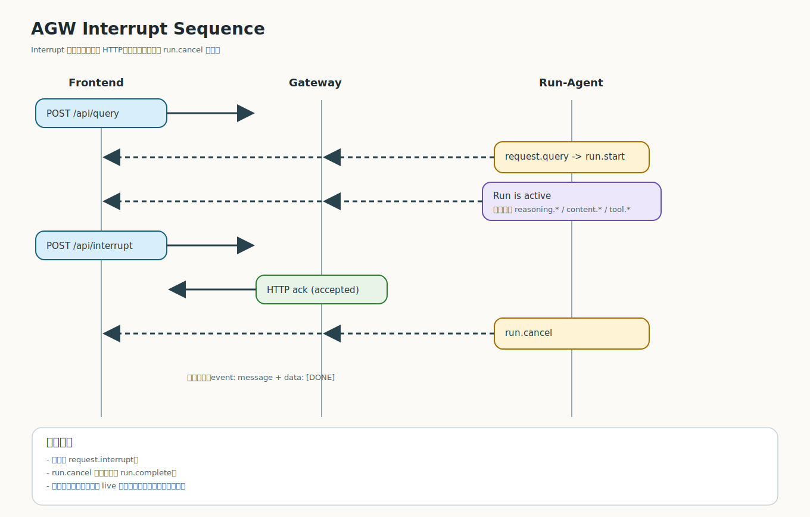
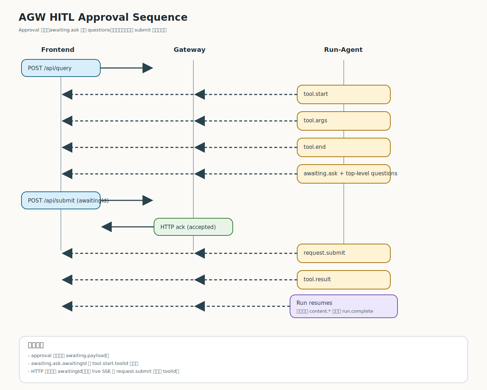
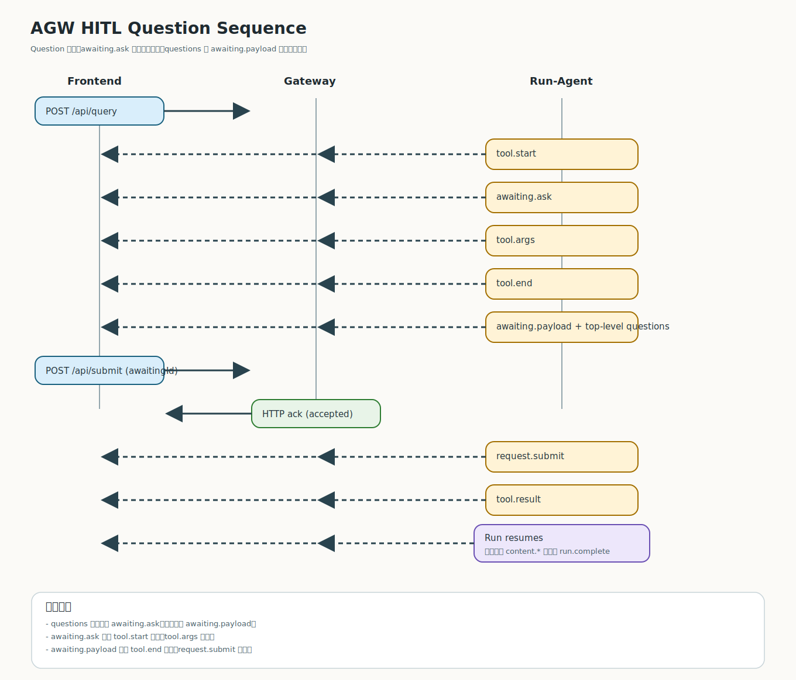
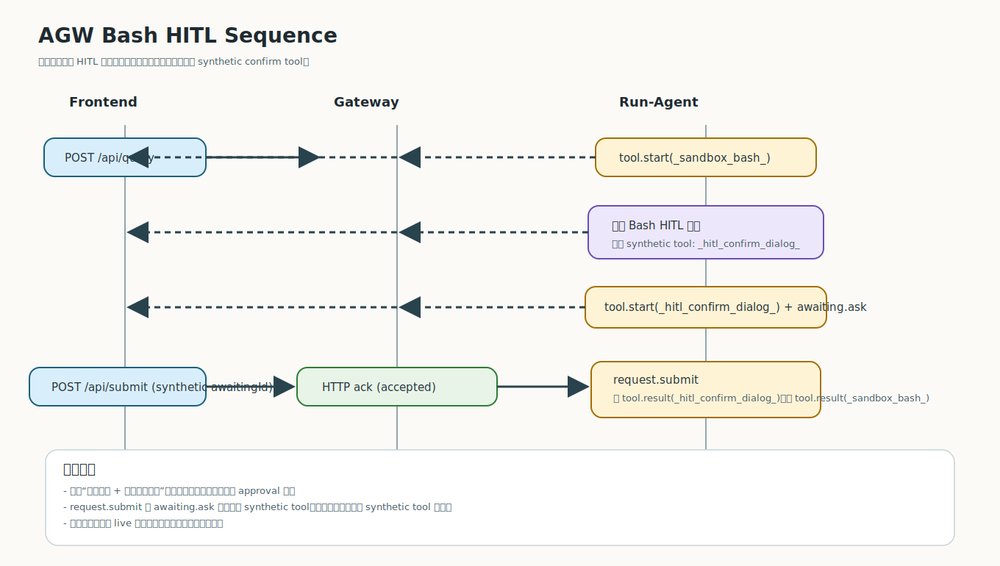
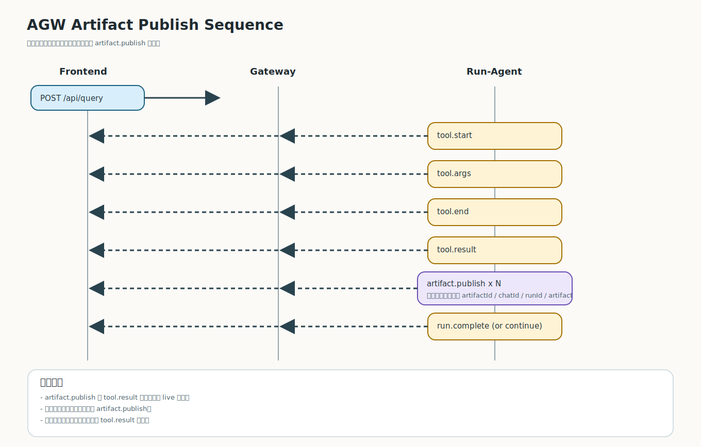

# 交互时序图

本页把 AGW 的 live 协议交互拆成多张 SVG 时序图，只覆盖前端真实可见的 `HTTP + live SSE`，不画 snapshot / persisted 历史事件。

## 1. 总览图

总览图只负责说明 Query、Submit、Steer、Interrupt 的入口关系与分流，不展开复杂分支细节。

## 2. 基础 Query 流

适用于没有前端交互打断的主时序：`request.query -> [chat.start] -> run.start -> ... -> run.complete|run.error -> [DONE]`。

## 3. 运行中 Steer

`steer` 通过独立 HTTP 请求注入，但效果继续体现在原 SSE 流里，关键 live 事件是 `request.steer`。

## 4. 运行中 Interrupt

`interrupt` 的同步确认来自 HTTP，流内最终语义由 `run.cancel` 表达，之后跟 `[DONE]`。

## 5. Approval 型 HITL

approval 模式下，`awaiting.ask` 直接携带顶层 `questions`，没有 `awaiting.payload`。

## 6. Question 型 HITL

question 模式下，`awaiting.ask` 只声明等待态，问题列表通过 `awaiting.payload` 单独下发。

## 7. Bash HITL 嵌套确认

危险命令命中规则时，会出现“原始工具 + synthetic confirm tool”的双层时序，`request.submit` 绑定的是 synthetic tool。

## 8. 产物发布

一次工具调用可以在 `tool.result` 之后连续发出多条 `artifact.publish`。

## 9. 统一边界

- 这里只画前端真实可见的 live 协议，不画 `reasoning.snapshot`、`content.snapshot`、`tool.snapshot`、`action.snapshot`
- 不画不存在的 `request.interrupt`
- 不在 `tool.start` 上标注当前实现没有的 `toolType`、`viewportKey`、`toolTimeout`
- `POST /api/submit` 的 HTTP 字段名是 `awaitingId`；当前流内 `request.submit` 事件仍使用 `toolId`
